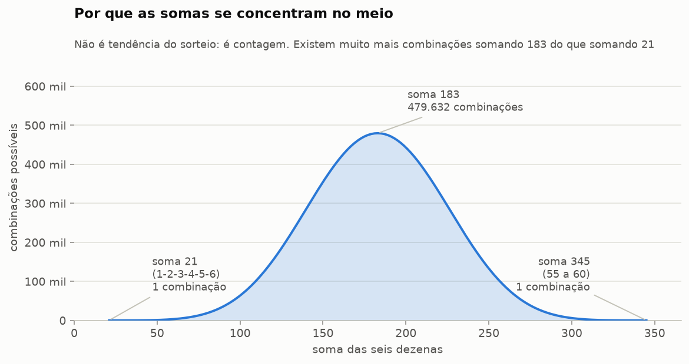
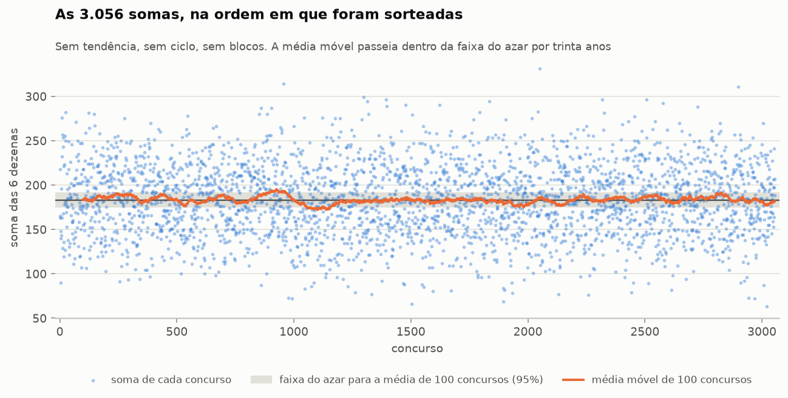
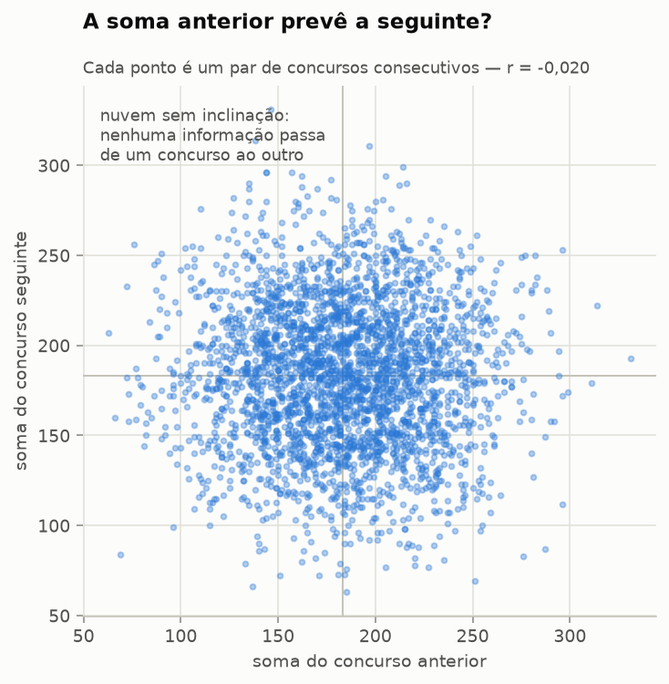
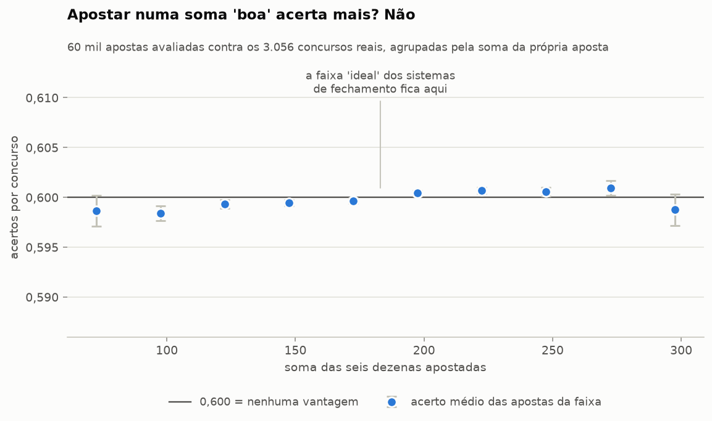

# A soma das dezenas tem padrão?

**Resposta curta: a soma tem uma *forma*, e essa forma não serve para apostar.**

Vinte testes sobre as 3.056 somas já sorteadas. A distribuição em sino é real —
mas ela é pura contagem de combinações, não tendência do sorteio. A série das
somas não tem memória nenhuma: nem autocorrelação, nem ciclo, nem tendência,
nem blocos. E apostar numa soma "boa" não acerta mais que apostar numa soma
"ruim".

Apenas um teste ficou abaixo de p = 0,05 (a maior soma da história, p = 0,029),
e ele não sobrevive à correção para testes múltiplos.

Complementa o [relatório principal](RELATORIO.md) e o [temporal](RELATORIO-TEMPORAL.md).

---

## Par ou ímpar?

Como a pergunta veio junto, vai direto:

| | Observado | Teoria | |
|---|---|---|---|
| Somas **pares** | 1.552 (50,79%) | 25.029.900 combinações | 49,996% |
| Somas **ímpares** | 1.504 (49,21%) | 25.033.960 combinações | 50,004% |

Empate técnico, com p = 0,385. A vantagem teórica é do ímpar, por **4.060
combinações em 50 milhões** — 0,008%, e calculável exatamente. Na prática saíram
48 somas pares a mais que ímpares, que é o tipo de diferença que 3.056
lançamentos de moeda produzem sem esforço.

E se a pergunta for sobre as **dezenas** em vez da soma: 1.073 concursos tiveram
mais dezenas pares, 1.041 tiveram mais ímpares, e 942 saíram empatados em 3 a 3.
Também empate.

---

## 1. A forma: o sino existe e é só contagem

Este é o gráfico que explica o assunto inteiro. Existem **479.632 combinações**
que somam 183, e exatamente **uma** que soma 21 (1-2-3-4-5-6). Por isso as somas
sorteadas se amontoam no meio: não porque o globo prefira o meio, mas porque
quase todas as combinações estão lá.

A distribuição observada bate com a combinatória exata em tudo que se pode medir:

| Medida | Observado | Valor exato | p |
|---|---|---|---|
| Média | 183,17 | 183,00 | 0,83 |
| Desvio padrão | 39,90 | 40,58 | 0,17 |
| Assimetria | 0,004 | 0 | 0,93 |
| Curtose | −0,15 | −0,20 | 0,44 |
| Aderência da distribuição inteira | — | — | 0,38 |

As caudas: a menor soma já sorteada foi **63** e a maior, **331**. Em históricos
simulados de mesmo tamanho, o mínimo dá 53 em média e o máximo 313. O mínimo
real é alto demais? p = 0,21. O máximo é alto demais? p = 0,029 — o único valor
abaixo de 5% desta análise, e que cai na correção para vinte testes.

Dígito final da soma e resto da divisão por 3 — dois recortes de folclore —
também não mostram nada (p = 0,50 e p = 0,12).

## 2. A memória: não existe

Seis testes diferentes procurando estrutura temporal na série das somas. Todos
negativos:

| Pergunta | Resultado | p |
|---|---|---|
| A soma de um concurso prevê a do próximo? | Ljung-Box com 30 defasagens | 0,78 |
| Existe inclinação entre soma anterior e seguinte? | coeficiente −0,020 | 0,27 |
| As somas andam em blocos altos e baixos? | teste de sequências | 0,35 |
| Qual a maior sequência seguida do mesmo lado da mediana? | 11 concursos (azar dá 11,9) | 0,78 |
| A série sobe e desce como ruído? | pontos de retorno | 0,63 |
| Existe ciclo escondido? | teste g de Fisher no periodograma | 0,74 |
| A soma média sobe ou desce em 30 anos? | Mann-Kendall, τ = −0,005 | 0,70 |

A maior autocorrelação entre 30 defasagens é de −0,033. O teste de
periodicidade merece um comentário: ele varre **todas** as frequências possíveis
procurando qualquer ciclo — de dois concursos a mil e quinhentos — e a
frequência mais forte da série real concentra *menos* energia do que a mais
forte de uma série aleatória típica.

E a pergunta mais comum de todas — "depois de uma soma alta, vem o quê?":

| Depois de uma soma… | …vem baixa | …vem média | …vem alta |
|---|---|---|---|
| **baixa** (até 165) | 31,4% | 33,0% | 35,6% |
| **média** (166 a 201) | 33,3% | 33,0% | 33,7% |
| **alta** (202 ou mais) | 33,2% | 33,9% | 33,0% |

Nove células, todas coladas em 33,3%. p = 0,75.

## 3. A prática: o sino não vira vantagem

Aqui mora o erro que sustenta os sistemas de fechamento por soma. O raciocínio
é: "as somas sorteadas se concentram entre 150 e 220, logo devo jogar
combinações nessa faixa". A primeira metade é verdade. A segunda não segue.

A soma 183 é a mais provável *entre as somas* — mas essa probabilidade está
repartida entre 479.632 combinações diferentes. Cada uma delas vale exatamente
1 em 50.063.860, igual à 1-2-3-4-5-6, que é a única com soma 21. **Escolher a
soma popular não te dá nenhuma das outras 479.631 combinações.**

Para medir isso em vez de argumentar: avaliei 60 mil apostas contra os 3.056
concursos reais, agrupadas pela soma da própria aposta.

| Soma da aposta | Apostas avaliadas | Acertos por concurso |
|---|---|---|
| 21 a 120 | 2.441 | 0,5987 |
| 121 a 150 | 6.141 | 0,5993 |
| 151 a 170 | 6.577 | 0,6001 |
| 171 a 196 | 9.784 | 0,6001 |
| 197 a 216 | 6.560 | 0,6000 |
| 217 a 246 | 6.071 | 0,6005 |
| 247 a 345 | 2.426 | 0,5999 |

Linha reta em 0,600. A correlação entre a soma da aposta e o acerto é 0,025,
dentro da faixa que o acaso produz (−0,26 a 0,25), p = 0,85.

E quatro apostas fixas, avaliadas na história inteira:

| Aposta | Soma | Acertos por concurso | Melhor resultado em 30 anos |
|---|---|---|---|
| 1-2-3-4-5-6 | 21 | 0,605 | terno |
| 8-15-28-37-45-50 | 183 | 0,595 | terno |
| 5-17-29-41-45-46 | 183 | 0,617 | terno |
| 55-56-57-58-59-60 | 345 | 0,575 | **quadra** |

A aposta que todo sistema de fechamento manda evitar — as seis dezenas mais
altas, soma 345, a pior "distribuição" possível — é a única das quatro que fez
uma quadra em trinta anos. As duas de soma 183, a soma "ideal", não passaram de
terno.

Isso não prova que 55-60 seja melhor. Prova o contrário do que o sistema promete:
a soma da aposta não informa nada sobre o resultado dela.

---

## Uma nota sobre um falso positivo que eu mesmo produzi

Vale registrar porque é instrutivo. Na primeira versão, o teste de correlação
entre soma da aposta e acertos deu **p = 0,0003** — e teria entrado neste
relatório como o único padrão encontrado em toda a análise.

Era artefato. Eu estava usando 60 mil apostas como se fossem 60 mil observações
independentes, quando elas são reamostragens das mesmas 60 frequências de
dezena. Dobrar o número de apostas reduzia o p pela metade sem acrescentar
informação nenhuma sobre a Mega-Sena. A informação real ali tem 60 graus de
liberdade, não 60 mil.

O nulo correto embaralha as 60 frequências entre as 60 dezenas e refaz a conta.
Com ele, p = 0,85.

É exatamente o tipo de erro que produz manchete de "padrão descoberto na
Mega-Sena": uma estatística correta, calculada sobre uma amostra inflada
artificialmente.

## Os 20 testes

| Teste | p |
|---|---|
| A maior soma da história é extrema demais? | 0,029 |
| A soma cai mais em algum resto da divisão por 3? | 0,121 |
| A dispersão das somas é a prevista? | 0,173 |
| A menor soma da história é extrema demais? | 0,212 |
| Existe inclinação entre a soma anterior e a seguinte? | 0,270 |
| As somas se agrupam em blocos altos e baixos? | 0,350 |
| A distribuição bate com a combinatória exata? | 0,381 |
| Somas pares e ímpares na proporção prevista? | 0,385 |
| As caudas têm o peso previsto? | 0,444 |
| Algum dígito final da soma aparece mais? | 0,503 |
| A série sobe e desce como ruído puro? | 0,626 |
| A soma média sobe ou desce ao longo de 30 anos? | 0,698 |
| Existe algum ciclo escondido na série? | 0,741 |
| Depois de uma soma alta vem o quê? | 0,746 |
| A maior sequência do mesmo lado da mediana é anormal? | 0,778 |
| A soma de um concurso prevê a do próximo? | 0,781 |
| A soma média é 183? | 0,829 |
| Apostas de soma central acertam mais? | 0,852 |
| Dezenas altas saem mais que dezenas baixas? | 0,873 |
| A distribuição das somas é simétrica? | 0,926 |

Vinte testes a 5% deveriam produzir um falso positivo. Produziram um: a maior
soma da história, que não sobrevive à correção.

## Conclusão

A soma é o caso mais bonito desta análise inteira, porque nela existe mesmo um
padrão visível — o sino — e ele é completamente inútil para apostar. O sino não
é comportamento do sorteio: é o formato da própria caixa de combinações. Usá-lo
para escolher jogo é confundir "a soma 183 é comum" com "a minha combinação de
soma 183 é provável". A primeira frase é verdadeira; a segunda não decorre dela.

Saída completa em [`dados/resultados_soma.json`](dados/resultados_soma.json).
