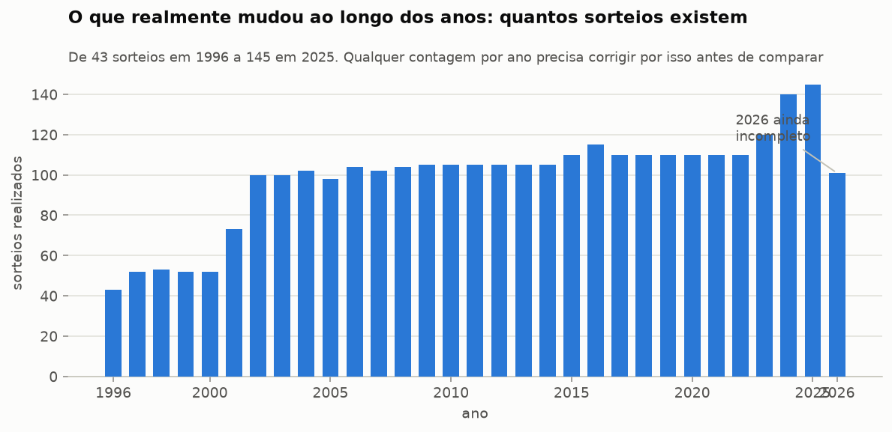
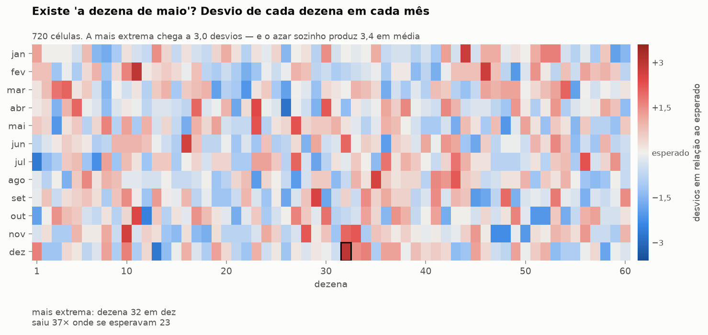
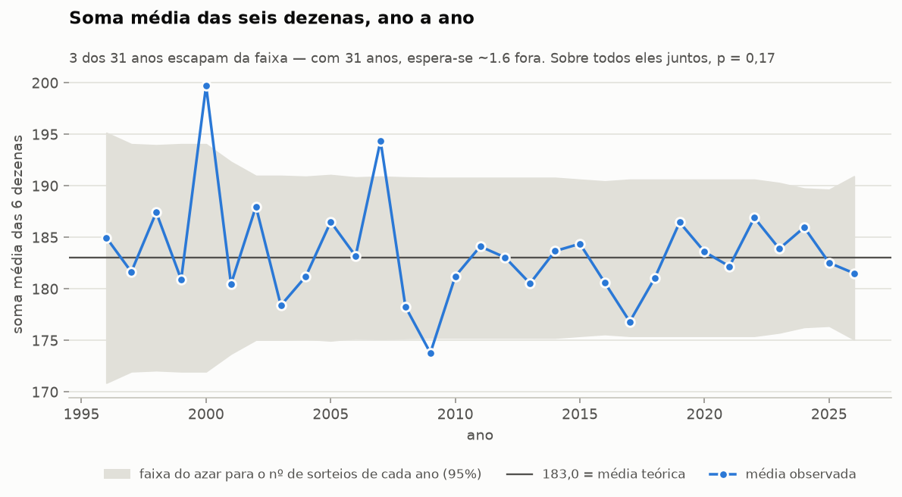
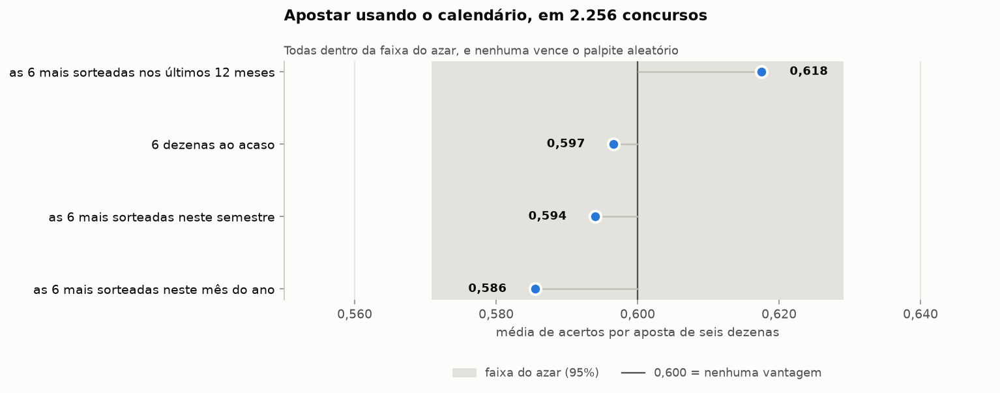

# A Mega-Sena tem padrão por ano, semestre ou mês?

**Resposta curta: não, e desta vez sem nem um fio solto.** Dezenove testes
recortando os 3.056 concursos por ano, por semestre e por mês. **Nenhum ficou
abaixo de p = 0,05 nem antes da correção para testes múltiplos** — o resultado
mais limpo das duas análises.

Este relatório complementa o [principal](RELATORIO.md), que pergunta se existe
padrão nos números sem olhar o calendário. Aqui a pergunta é outra: *quando* se
joga muda alguma coisa?

---

## Primeiro: o dado precisou ser consertado

A análise anterior tinha 185 concursos sem data (2366 a 2550) — justamente o
período que cobre quase todo 2021 e 2022. Para uma análise por ano e por mês
isso não servia: faltava um pedaço de dois anos bem no meio.

Uma quarta fonte pública ([gnai-creator/gerasena.com](https://github.com/gnai-creator/gerasena.com))
cobre os concursos 1 a 2896 com datas. Conferi contra o que já tinha: **as 2.896
combinações de dezenas batem exatamente**, e as datas batem em todas menos uma.

Nessa uma, o concurso 1754, a fonte antiga dizia 04/10/2015 — um domingo, numa
época em que só havia sorteio às quartas e aos sábados. A nova diz 24/10/2015,
um sábado, coerente com os vizinhos (1753 em 21/10, 1755 em 28/10). Corrigido.

Agora os 3.056 concursos têm data. **Nenhuma dezena mudou** em relação à análise
anterior — só datas foram acrescentadas.

Fica registrado um problema que sobra na ponta recente: a partir do concurso
3033 (julho de 2026), a única fonte disponível coloca o sorteio de sábado no
domingo seguinte, mantendo terça e quinta no lugar. É quase certamente erro de
data dela. Por isso o teste de dia da semana para no concurso 2896, onde duas
fontes independentes confirmam a data. Ano e mês não são afetados: um deslize
de um dia quase nunca troca o mês.

## O que muda de verdade ao longo dos anos

Antes de comparar qualquer coisa entre anos, é preciso enxergar isto: em 1996
houve 43 sorteios; em 2025, foram 145. A Mega-Sena passou de um sorteio semanal
para dois em 2001, e para três em 2024.

Isso significa que contar "quantas vezes a dezena 10 saiu em 2025" e comparar
com 1996 não diz nada — 2025 teve três vezes mais sorteios. Todos os testes
abaixo comparam **proporções dentro de cada período**, nunca contagens brutas.

## 1. As dezenas não mudam de comportamento com o período

| Recorte | Qui-quadrado | p | Veredito |
|---|---|---|---|
| 31 anos × 60 dezenas | 1.687,5 | 0,113 | compatível com azar |
| 62 semestres × 60 dezenas | 3.378,3 | 0,140 | compatível com azar |
| 12 meses × 60 dezenas | 560,9 | 0,844 | compatível com azar |

O recorte por mês é o mais próximo do "nada acontecendo" que se pode chegar:
p = 0,84 significa que a tabela real é *mais parecida* com o esperado do que a
maioria dos históricos simulados.

## 2. Não existe "a dezena de maio"

Esse mapa é a resposta visual à pergunta. Cada quadradinho é uma dezena num mês:
azul saiu menos que o esperado, vermelho saiu mais. São 720 quadradinhos.

Procurar a célula mais extrema entre 720 sempre acha alguma coisa — por isso o
teste não olha célula por célula, e sim compara **o máximo observado com o
máximo que o azar produz na mesma busca**:

| | Célula mais extrema | O azar sozinho produz | p |
|---|---|---|---|
| dezena × mês (720 células) | 2,99 desvios | 3,41 em média | 0,89 |
| dezena × ano (1.860 células) | 4,56 desvios | 3,86 em média | 0,061 |

A célula mais extrema de todas: **a dezena 13 saiu 24 vezes em 2004**, onde se
esperavam 10,2 em 102 sorteios. Parece muito — e é o único número desta análise
que chega perto da fronteira (p = 0,061 depois de descontar que a busca varreu
1.860 combinações). Ainda assim é o que se espera encontrar: em históricos
simulados, a célula mais extrema chega a 4,61 desvios uma vez a cada vinte.

Tem graça que seja a 13, a dezena com fama de azarada, e que na história inteira
está entre as menos sorteadas. Em 2004 ela foi a mais quente do ano. É assim que
o acaso funciona.

As cinco células mais extremas por mês, para constar: dezena 32 em dezembro
(37× contra 23 esperadas), 11 em fevereiro (37× contra 23), 26 em abril (12×
contra 25), 44 em janeiro (38× contra 25) e 46 em fevereiro (36× contra 23).

## 3. Nenhuma dezena está em ascensão ou declínio

Testei tendência linear ao longo dos 30 anos para cada uma das 60 dezenas. A
mais forte é a dezena 11, com 2,56 desvios de tendência de alta — e o azar
sozinho produz 3,3 como máximo entre 60 dezenas (p = 0,47).

Nenhuma dezena está "esquentando" ou "esfriando" com o tempo. As demais do topo:
46 (+2,29), 12 (−2,29), 10 (+2,16), 9 (+2,14).

## 4. A soma das dezenas é estável ano após ano

| Recorte | Teste | p |
|---|---|---|
| Soma média × 31 anos | Kruskal-Wallis | 0,17 |
| Soma média × 12 meses | Kruskal-Wallis | 0,86 |
| 1º semestre (182,7) × 2º semestre (183,6) | Mann-Whitney | 0,59 |
| Pares/ímpares × 12 meses | qui-quadrado | 0,33 |

Três anos escapam da faixa: 2000 (média 199,7), 2007 (194,4) e 2009 (173,8).
Com 31 anos e uma faixa de 95%, espera-se cerca de 1,5 fora — três não é
surpresa (acontece em uma a cada cinco histórias), e o teste sobre todos os anos
juntos dá p = 0,17. E repare no formato do gráfico:
a faixa é larga nos anos 1990, quando havia 43 a 52 sorteios por ano, e estreita
depois de 2001 — menos sorteios, mais oscilação. Os anos que mais se afastam são
exatamente os de menor volume, que é o que a matemática prevê.

Por mês, os extremos são maio (179,9) e julho (187,8), contra os 183,0 teóricos.
Diferença de sete pontos numa escala que vai de 21 a 345, e dentro do ruído.

## 5. O folclore do calendário: a data sai no sorteio?

Três crenças comuns, três testes diretos:

| Crença | Saiu | Esperado | Taxa | p |
|---|---|---|---|---|
| O dia do mês sai entre as dezenas | 327 | 305,6 | 10,70% | 0,19 |
| O número do mês sai entre as dezenas | 332 | 305,6 | 10,86% | 0,12 |
| Os dois últimos dígitos do ano saem | 306 | 280,4 | 10,91% | 0,11 |

Curiosidade honesta: **os três deram para o mesmo lado**, todos um pouco acima
dos 10%. Nenhum chega perto da significância, e eles não são independentes entre
si — usam os mesmos sorteios. Se houvesse mesmo algo aqui, apareceria com muito
mais força em 3.056 concursos. Anote como coincidência simpática, não como
achado.

## 6. Dia da semana e Mega da Virada

**Dia da semana** (concursos 1 a 2896, onde duas fontes confirmam a data):
1.379 sábados, 1.014 quartas, 186 quintas e 175 terças. As dezenas se distribuem
igual nos quatro dias (p = 0,64). Sorteio de sábado não é diferente de sorteio
de quarta.

**Mega da Virada**: 23 sorteios de 31 de dezembro, p = 0,57. Mas aqui a honestidade
exige um aviso maior que o resultado: **23 sorteios não têm poder estatístico
nenhum**. Esse teste só detectaria um desvio gigantesco. Não conclua que a Virada
é igual às outras — conclua que 23 sorteios não permitem dizer nada.

## 7. A prova prática: apostar pelo calendário

O teste que fecha a questão: 2.256 concursos, apostando com o calendário e só
com informação anterior a cada sorteio.

| Estratégia | Acertos por aposta | p |
|---|---|---|
| As 6 mais sorteadas nos últimos 12 meses | 0,618 | 0,24 |
| 6 dezenas ao acaso | 0,597 | 0,82 |
| As 6 mais sorteadas neste semestre | 0,594 | 0,68 |
| As 6 mais sorteadas neste mês do ano | 0,586 | 0,33 |

Apostar nas dezenas quentes do mês do ano — a estratégia que mais se vê em
planilha de apostador — foi a **pior** das quatro, abaixo do palpite aleatório.
A dos últimos 12 meses ficou em primeiro, dentro da faixa do azar e sem
significância (é a mesma família de "janela quente" que o relatório principal já
tinha examinado e descartado).

Nenhuma sena, nenhuma quina em 2.256 apostas de qualquer uma delas.

---

## Os 19 testes

| Teste | Estatística | p |
|---|---|---|
| Célula dezena×ano mais extrema | 4,56 | 0,061 |
| Dois últimos dígitos do ano saem mais? | 306 | 0,108 |
| Frequências mudam de ano para ano? | 1.687,5 | 0,113 |
| Número do mês sai entre as dezenas? | 332 | 0,117 |
| Frequências mudam de semestre para semestre? | 3.378,3 | 0,140 |
| Soma média muda de ano para ano? | 37,4 | 0,167 |
| Dia do mês sai entre as dezenas? | 327 | 0,195 |
| Apostar nas 6 mais sorteadas nos últimos 12 meses | z = 1,18 | 0,238 |
| Paridade muda conforme o mês? | 47,7 | 0,325 |
| Apostar nas 6 mais sorteadas neste mês do ano | z = −0,98 | 0,329 |
| Alguma dezena tem tendência ao longo dos anos? | 2,56 | 0,466 |
| Mega da Virada tem comportamento próprio? | 51,6 | 0,574 |
| Soma do 1º semestre difere da do 2º? | — | 0,587 |
| Dia da semana muda as dezenas? | 155,0 | 0,637 |
| Apostar nas 6 mais sorteadas neste semestre | z = −0,41 | 0,684 |
| Apostar em 6 dezenas ao acaso | z = −0,23 | 0,820 |
| Algum mês favorece algumas dezenas? | 560,9 | 0,844 |
| Soma média muda conforme o mês? | 6,2 | 0,862 |
| Célula dezena×mês mais extrema | 2,99 | 0,888 |

Dezenove testes a 5% deveriam produzir cerca de um falso positivo só por azar.
Desta vez não produziram nenhum — o menor p foi 0,061.

## Conclusão

Ano, semestre, mês, dia da semana, dia do mês, tendência de longo prazo: nada.
A Mega-Sena de janeiro é igual à de julho, a de 2004 é igual à de 2024, e a de
sábado é igual à de quarta.

A única coisa que realmente mudou nesses trinta anos foi a frequência dos
sorteios — de 43 por ano para 145. Isso muda quantas vezes você pode apostar,
não a chance de cada aposta, que segue sendo uma em 50.063.860.

Há ainda um terceiro recorte, sobre a soma das dezenas, em
[`RELATORIO-SOMA.md`](RELATORIO-SOMA.md).

Reprodução, dados e limitações em [`README.md`](README.md). Saída completa dos
testes em [`dados/resultados_temporais.json`](dados/resultados_temporais.json).
