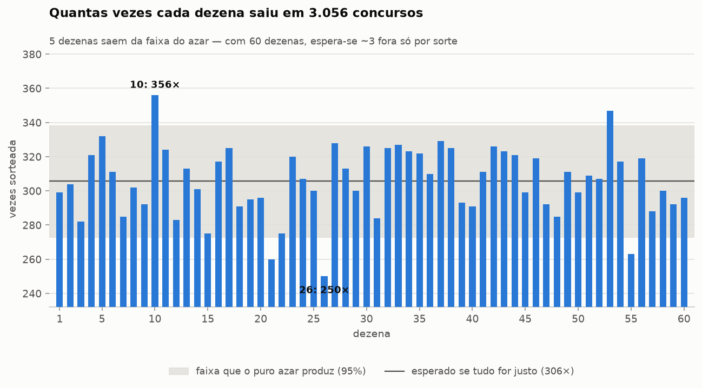
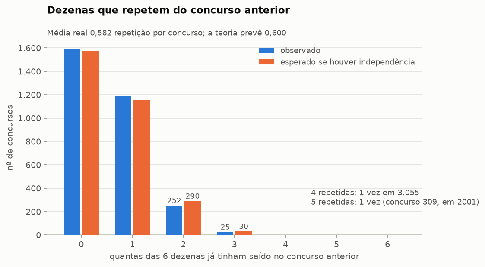
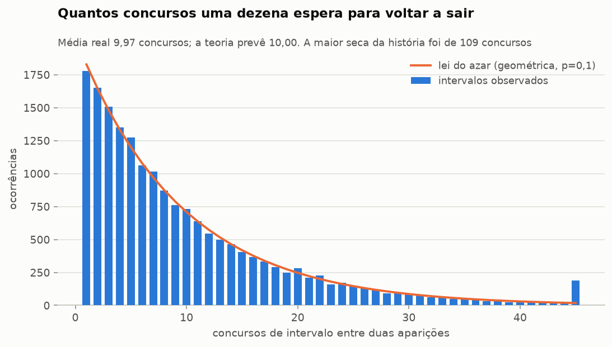
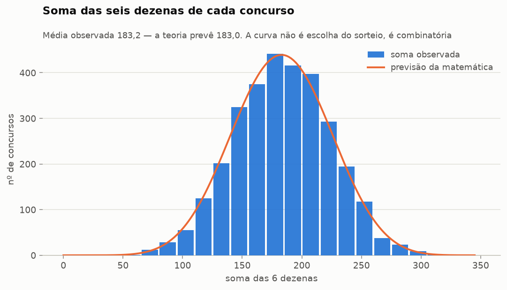
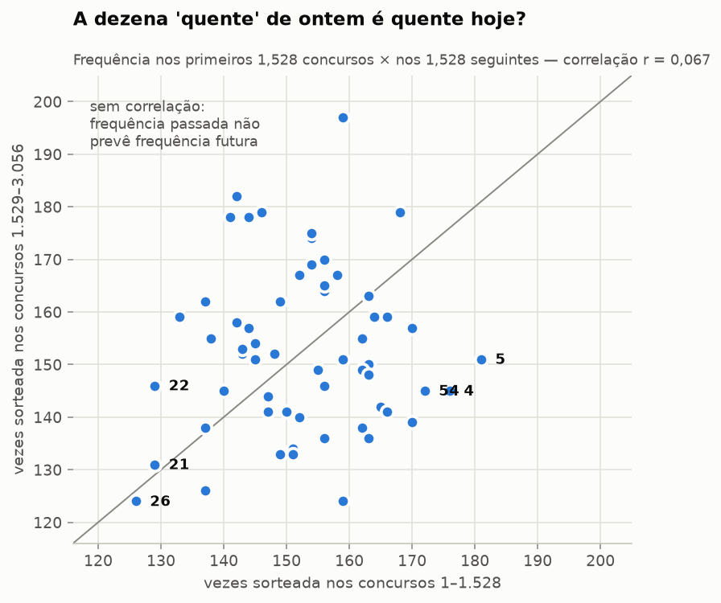
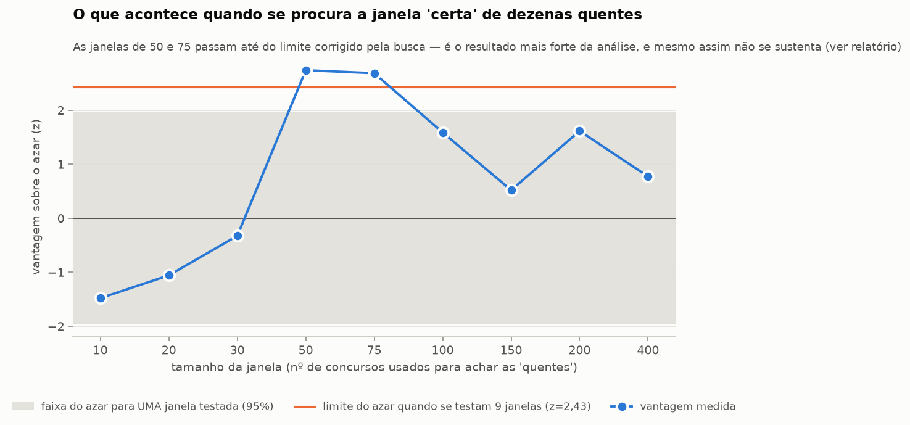
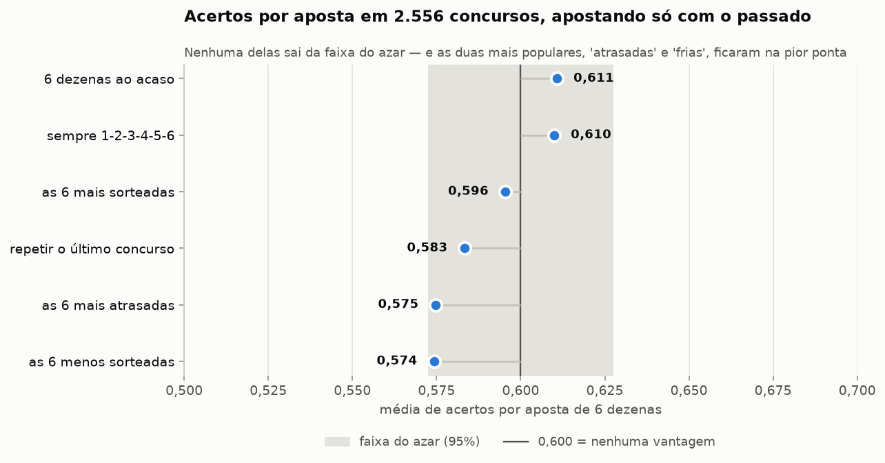

# Existe padrão nos números da Mega-Sena?

**Resposta curta: não existe padrão que sirva para apostar.** Rodei 26 testes
estatísticos sobre os 3.056 concursos já realizados (11/03/1996 a 10/09/2026,
18.336 dezenas sorteadas). Nenhum deles sobrevive à correção para testes
múltiplos. Duas anomalias ficaram na fronteira e estão documentadas na íntegra
mais abaixo — nenhuma das duas rende aposta melhor.

A parte que interessa na prática: sete estratégias apostando 6 dezenas em 2.556
concursos, cada uma usando apenas informação disponível antes do sorteio. A
melhor de todas foi **escolher 6 dezenas ao acaso**. As duas mais populares do
folclore — jogar nas "atrasadas" e nas "frias" — ficaram na pior ponta.

---

## Como a pergunta foi tratada

"Existe padrão?" não se responde olhando para os números e achando que algo
salta aos olhos. O olho humano acha padrão em qualquer sequência aleatória —
esse é justamente o problema. A única resposta que vale é comparativa: **medir
uma coisa no histórico real e comparar com o que o puro azar produziria** na
mesma quantidade de sorteios.

Então cada teste aqui tem a mesma forma: uma estatística, uma hipótese nula
explícita, e uma distribuição de referência — fórmula fechada quando existe
(hipergeométrica, geométrica, combinatória exata), e 20.000 simulações de Monte
Carlo quando não existe.

Os dados vêm de três fontes públicas independentes, com **2.612 concursos
aparecendo em mais de uma** e dezenas idênticas em todos eles. O script aborta
se encontrar divergência. Detalhes e limitações em [`README.md`](README.md).

---

## 1. As 60 dezenas saem com a mesma frequência

Com 3.056 concursos, cada dezena deveria sair cerca de **305,6 vezes**. A mais
sorteada da história, a **10**, saiu 356 vezes; a menos sorteada, a **26**, saiu
250. Parece muita diferença — 106 sorteios separando as duas pontas.

Não é. Em 20.000 históricos simulados, com sorteio perfeitamente justo, essa
distância deu em média **77**, e ficou entre 59 e 100 em 95% dos casos. O valor
real, 106, está logo acima dessa faixa (p = 0,010). É a diferença que o acaso
produz por si só quando se comparam 60 números ao longo de 30 anos.

O teste qui-quadrado global dá 79,89 (p = 0,0096 por Monte Carlo). Fica na
fronteira, e a razão está na seção 6.

**O que isso significa para quem aposta:** a "dezena mais sorteada" existe em
qualquer histórico, inclusive nos simulados. Ter saído mais não é propriedade da
dezena, é propriedade da tabela — sempre haverá uma no topo.

## 2. Um concurso não carrega informação do anterior

Quatro testes diferentes, todos negativos:

| Pergunta | Medido | Esperado sem padrão | p |
|---|---|---|---|
| Dezenas repetidas do concurso anterior | 0,582 por concurso | 0,600 | 0,13 |
| Sair muda a chance de sair de novo? | 9,70% contra 10,03% | sem diferença | 0,16 |
| A soma de um concurso prevê a do próximo? | Ljung-Box 9,53 (10 defasagens) | — | 0,48 |
| A soma anda em blocos acima/abaixo da mediana? | z = 0,94 | — | 0,35 |

Uma dezena que acabou de sair tem 9,70% de chance de sair no concurso seguinte;
uma que não saiu tem 10,03%. A diferença é de um terço de ponto percentual, e
dentro do ruído.

O caso extremo: no **concurso 309 (31/10/2001), cinco das seis dezenas repetiram
o concurso 308**. Parece impossível. A teoria prevê que isso aconteça 1,3 vez em
3.055 concursos. Aconteceu uma vez.

## 3. "Dezena atrasada" não está devendo nada

O intervalo médio entre duas aparições da mesma dezena foi de **9,97 concursos**;
a teoria prevê exatamente 10,00. A distribuição inteira dos intervalos segue a
curva geométrica (p = 0,28), que é a assinatura matemática de um processo **sem
memória**.

A maior seca da história foi de **109 concursos**. Em históricos simulados, a
maior seca deu em média 98,7 e ficou entre 81 e 126. Ou seja: uma seca dessas é
exatamente o que se espera aparecer, e não indica que a dezena "vai sair".

Hoje a dezena mais atrasada é a **41**, há 44 concursos sem sair. A chance dela
sair no próximo concurso é 10% — a mesma de todas as outras.

## 4. A forma da combinação também não guarda segredo

| Teste | Observado | Teoria | p |
|---|---|---|---|
| Soma das 6 dezenas | média 183,2 (dp 39,9) | 183,0 (dp 40,6) | 0,44 |
| Pares × ímpares | 942 concursos com 3–3 | 1.006 | 0,19 |
| Dezenas 1–30 × 31–60 | 1.037 concursos com 3–3 | 1.006 | 0,25 |
| Seis faixas (1-10, 11-20, …) | 2.979 a 3.129 por faixa | 3.056 | 0,45 |
| Dígito final da dezena | — | equiprovável | 0,39 |
| Ao menos duas dezenas consecutivas | 1.282 concursos (41,95%) | 1.286 (42,09%) | 0,87 |
| Dupla mais frequente (5 e 27) | 43 vezes juntas | azar produz entre 41 e 50 | 0,88 |
| Primeira bola sorteada | — | uniforme | 0,16 |
| Valor da dezena × posição de saída | médias de 30,1 a 30,9 | iguais | 0,70 |

Dois resultados aqui merecem atenção porque contrariam a intuição:

- **Dezenas consecutivas são comuns**, não raras: 42% dos concursos têm pelo
  menos um par colado (24 e 25, por exemplo). Quem evita consecutivas por achar
  que "não sai" está descartando quatro de cada dez resultados possíveis.
- **A dupla mais frequente da história saiu junto 43 vezes** (5 e 27). Em
  históricos aleatórios, a dupla campeã costuma aparecer entre 41 e 50 vezes. A
  concentração real é até *menor* que a típica do acaso.

A curva da soma não é escolha do sorteio: somas perto de 183 são mais comuns
simplesmente porque existem muito mais combinações que somam 183 do que
combinações que somam 30. Isso é combinatória, não tendência — e por isso não
ajuda: dentro da faixa central, cada combinação individual continua tendo
exatamente a mesma chance.

## 5. A dezena quente de ontem não é a de hoje

Este é o teste que mata a estratégia de "seguir as quentes". Dividindo a história
ao meio, a correlação entre a frequência de uma dezena nos primeiros 1.528
concursos e nos 1.528 seguintes é **r = 0,067** (p = 0,61) — indistinguível de
zero.

Das seis dezenas mais sorteadas na primeira metade, **apenas uma** continuou no
grupo das seis mais sorteadas na segunda. Comparando as quatro eras da história,
as frequências são homogêneas (p = 0,56).

## 6. Os dois fios soltos

Uma análise honesta reporta o que ficou na fronteira, e não só o que confirma a
conclusão.

### A dezena 26

É a anomalia mais forte de 30 anos de sorteios. Saiu **250 vezes onde se
esperavam 305,6** — 3,35 desvios-padrão abaixo. Isoladamente, p = 0,00065.
Corrigindo pelo fato de que olhei todas as 60 dezenas e escolhi a mais extrema,
p ≈ 0,039. Continua no limite.

O que reforça a suspeita: ela está abaixo do esperado nas **quatro eras**
da história, sem exceção.

| Período | Saiu | Esperado | Desvio |
|---|---|---|---|
| 1996–2006 (concursos 1–800) | 64 | 80,0 | −1,89 |
| 2006–2014 (801–1600) | 66 | 80,0 | −1,65 |
| 2014–2021 (1601–2400) | 69 | 80,0 | −1,30 |
| 2021–2026 (2401–3056) | 51 | 65,6 | −1,90 |

O que enfraquece: tirando a 26 do cálculo, as outras 59 dezenas são
perfeitamente uniformes (p = 0,14). Ou seja, o desvio global da seção 1 é
essencialmente esta dezena. E "a mais extrema entre 60, num teste que fica em
p = 0,04 depois de corrigido" é exatamente o que aparece de vez em quando sem
causa nenhuma — 26 testes a 5% já produzem 1,3 falso positivo por construção.

**Mesmo se fosse vício real, não serviria de nada.** Com a frequência observada
da 26, evitá-la e jogar entre as 59 restantes mudaria a chance de sena de 1 em
50.063.860 para 1 em 45.057.474. Continua um bilhete perdido.

### A janela de dezenas quentes recentes

Apostar nas 6 dezenas mais sorteadas **nos últimos 50 concursos** rendeu 0,638
acerto por aposta contra os 0,600 do acaso — z = 2,74. Mesmo descontando o fato
de eu ter testado 9 tamanhos de janela e escolhido o melhor, p = 0,025. É o
resultado mais forte que encontrei.

Três razões para não acreditar nele:

1. **Não é robusto.** O efeito existe nas janelas de 50 e 75, e desaparece nas
   de 10, 20, 30, 100, 150, 200 e 400. Um mecanismo real não escolheria
   justamente esses dois valores.
2. **Enfraquece fora da amostra.** Na primeira metade do período apostado, z =
   2,48; na segunda metade, z = 1,40. Efeito verdadeiro não encolhe pela metade
   quando se olha para dados novos.
3. **Não sobrevive à correção do conjunto.** Entre os 26 testes desta análise,
   o critério de Benjamini-Hochberg exigiria p ≤ 0,0019 para o menor deles.

E, de novo, o tamanho do prêmio não muda: levando o efeito a sério, a chance de
sena iria de 1 em 50 milhões para cerca de 1 em 35 milhões.

## 7. A prova prática: apostar com o passado não acerta mais

Teste final, e o único que realmente importa: 2.556 concursos, sete estratégias,
cada uma escolhendo 6 dezenas com base **apenas no que já tinha acontecido**.

| Estratégia | Acertos por aposta | Melhor resultado em 2.556 apostas |
|---|---|---|
| 6 dezenas ao acaso | **0,611** | uma quadra |
| Sempre 1-2-3-4-5-6 | 0,610 | nenhuma quadra |
| As 6 mais sorteadas | 0,596 | nenhuma quadra |
| Repetir o último concurso | 0,583 | uma quadra |
| As 6 mais atrasadas | 0,575 | uma quadra |
| As 6 menos sorteadas | 0,574 | nenhuma quadra |

Todas dentro da faixa do azar (0,573 a 0,627). Nenhuma sena, nenhuma quina em
2.556 apostas de cada estratégia. E as duas estratégias que mais gente usa —
"atrasadas" e "frias" — ficaram nas duas últimas posições. Apostar em
1-2-3-4-5-6 durante 30 anos teria rendido praticamente o mesmo que a estratégia
mais sofisticada.

---

## O que fazer com isso

**Sobre escolher números:** não existe escolha melhor. Qualquer combinação de 6
dezenas tem 1 chance em 50.063.860. Sistemas, planilhas de atraso, dezenas
quentes, fechamento por soma ou paridade — nada disso altera esse número, e a
análise acima testou cada uma dessas ideias.

**A única decisão que muda alguma coisa** não é sobre ganhar, é sobre *dividir*:
o prêmio é rateado entre os acertadores, então combinações que muita gente joga
(datas de aniversário, que se concentram em 1–31; sequências; desenhos
geométricos no volante) pagam menos quando saem. Dezenas acima de 31 e
combinações sem padrão visual tendem a ser menos jogadas. Isso não aumenta a
chance de acertar — só o valor caso aconteça. Vale registrar que **isto eu não
medi**: não existe dado público sobre quais combinações as pessoas apostam, e a
afirmação vem do raciocínio sobre o rateio, não desta análise.

**Sobre o resto:** o sorteio ser imprevisível é o objetivo do projeto da
Mega-Sena, não uma falha. Os resultados aqui são o que se espera de um sistema
funcionando bem. A ausência de padrão é a notícia boa.

---

## E por ano, semestre ou mês?

Essa pergunta tem relatório próprio: [`RELATORIO-TEMPORAL.md`](RELATORIO-TEMPORAL.md).
São mais 19 testes recortando os mesmos concursos por ano, semestre, mês, dia da
semana e dia do mês. Resultado ainda mais limpo que este: nenhum teste ficou
abaixo de p = 0,05 nem antes da correção.

---

## Todos os 26 testes

| Teste | Estatística | p | Veredito |
|---|---|---|---|
| Frequência das 60 dezenas (qui-quadrado) | 79,89 | 0,0096 | limítrofe, cai na correção |
| Amplitude entre a mais e a menos sorteada | 106 | 0,0102 | limítrofe, cai na correção |
| Melhor janela de dezenas quentes (melhor de 9) | z = 2,74 | 0,0245 | limítrofe, cai na correção |
| Aposta nas 6 menos sorteadas | z = −1,85 | 0,065 | compatível com azar |
| Aposta nas 6 mais atrasadas | z = −1,82 | 0,069 | compatível com azar |
| Repetições do concurso anterior | 7,06 | 0,133 | compatível com azar |
| Recorrência da dezena (saiu → sai de novo?) | −0,003 | 0,156 | compatível com azar |
| Primeira bola sorteada é uniforme | 69,94 | 0,156 | compatível com azar |
| Maior seca da história | 109 | 0,174 | compatível com azar |
| Pares × ímpares | 8,78 | 0,186 | compatível com azar |
| Aposta repetindo o último concurso | z = −1,20 | 0,231 | compatível com azar |
| Dezenas 1–30 × 31–60 | 7,88 | 0,247 | compatível com azar |
| Distribuição dos intervalos entre aparições | 43,70 | 0,279 | compatível com azar |
| Sequências da soma (runs) | z = 0,94 | 0,350 | compatível com azar |
| Dígito final das dezenas | 9,56 | 0,387 | compatível com azar |
| Aposta em 6 dezenas ao acaso | z = 0,77 | 0,441 | compatível com azar |
| Distribuição da soma | 10,98 | 0,445 | compatível com azar |
| Seis faixas de dez | 4,77 | 0,445 | compatível com azar |
| Aposta fixa em 1-2-3-4-5-6 | z = 0,72 | 0,475 | compatível com azar |
| Autocorrelação da soma (Ljung-Box) | 9,53 | 0,483 | compatível com azar |
| Estabilidade das frequências entre 4 eras | 173,63 | 0,558 | compatível com azar |
| Correlação entre as duas metades da história | r = 0,067 | 0,609 | compatível com azar |
| Valor da dezena × posição de saída | 2,97 | 0,704 | compatível com azar |
| Aposta nas 6 mais sorteadas | z = −0,33 | 0,744 | compatível com azar |
| Dezenas consecutivas | z = −0,16 | 0,872 | compatível com azar |
| Dupla mais frequente da história | 43 | 0,885 | compatível com azar |

A 5% de significância, 26 testes produzem **1,3 falso positivo em média mesmo
quando nada está acontecendo**. Três deram p < 0,05, e nenhum sobrevive a
Benjamini-Hochberg ou Bonferroni. É a assinatura do acaso, não a de um padrão.

Dados brutos de cada teste — hipótese nula, detalhes e distribuições — em
[`dados/resultados.json`](dados/resultados.json).
